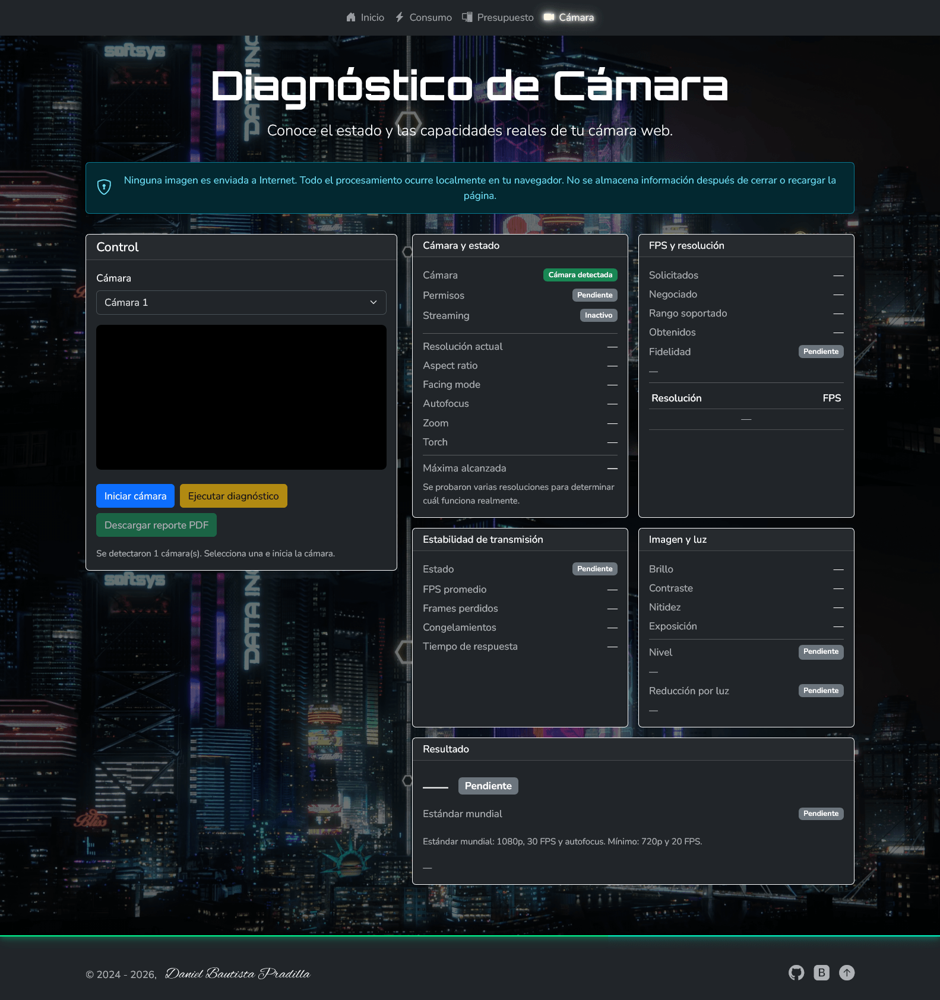

# Timber-Tec

Timber-Tec es un sitio de herramientas y utilidades orientadas al mundo del PC y sus periféricos. Incluye una calculadora de consumo eléctrico, una calculadora de presupuesto para armar un PC por piezas y un diagnóstico completo de la cámara web. Todo funciona desde el navegador, sin conexión a ningún servidor por parte de los cálculos.

El proyecto fue rediseñado de HTML puro a **Astro** (SSG estático).

## 🔗 Dirección web

Sitio desplegado: [https://timbertec.pages.dev/](https://timbertec.pages.dev/)

## 📄 Páginas del sitio

### 🏠 Inicio

Portal principal con un menú de pestañas que presentan las 3 herramientas disponibles (Consumo, Presupuesto y Cámara), cada una con una breve descripción y un botón para acceder a ella.

<details>
  <summary><strong>Ver captura — Menú inicial</strong></summary>


</details>

### ⚡ Calculadora de Consumo Eléctrico

Calcula el valor del consumo de aparatos eléctricos y electrónicos. A partir del costo de la energía (kWh), el consumo del aparato (W) y las horas de uso diario, muestra el gasto de dinero **diario**, **mensual (30 días)** y **anual (365 días)**.

- Soporta varias monedas: **COP, USD, EUR**.
- permite elegir las horas de uso diario (1 a 24).
- Conserva los **últimos 10 cálculos** en una tabla con su "alias" como identificador y permite limpiarlos.
- Validación de formulario y tooltips informativos (Bootstrap).

<details>
  <summary><strong>Ver captura de la Calculadora</strong></summary>


</details>

### 🖥️ Presupuesto para armar PC por piezas

Programa inspirado en la idea de @HeLion1ero. Con base en el dinero disponible, reparte el presupuesto de forma ponderada entre los componentes, mostrando cuánto gastar en cada uno.

- Rango de presupuestos: **hasta $ 1000**, **entre $ 1000 y 1500**, **entre $ 1500 y 2000**, **entre $ 2000 y 3000** y un perfil especial **para CSGO, Fortnite y Valorant**.
- Distribución porcentual por componente: **Gráfica, CPU, Placa madre, Fuente, SSD, Caja/Gabinete, RAM y Disipador**.
- Pestaña de **Créditos y explicación** con video incluido como homenaje a @HeLion1ero.

<details>
  <summary><strong>Ver captura del Presupuesto</strong></summary>


</details>

### 🎥 Diagnóstico de Cámara

Analiza el estado y las capacidades reales de la cámara web, de forma **100 % local** (ninguna imagen se envía a Internet). Ejecuta pruebas que miden:

- **Cámara y estado:** detección de cámaras, permisos, resolución actual, aspect ratio, facing mode, autofocus, zoom, torch y resolución máxima alcanzable (probando varias resoluciones).
- **FPS y resolución:** FPS solicitados, negociados, rango soportado, FPS reales obtenidos y fidelidad de FPS (detecta si la cámara anuncia más FPS de los que realmente entrega).
- **Estabilidad de transmisión:** FPS promedio, frames perdidos, congelamientos y tiempo de respuesta.
- **Imagen y luz:** brillo, contraste, nitidez y exposición, nivel de iluminación y detección de reducción de FPS por falta de luz.
- **Resultado:** puntaje sobre 100, clasificación, comparación con el estándar mundial (1080p, 30 FPS y autofocus; mínimo 720p y 20 FPS) y recomendación de compra.

Al final permite **descargar un reporte en PDF** con los resultados del diagnóstico.

<details>
  <summary><strong>Ver captura de la Cámara</strong></summary>



</details>

### 🖥️ Diagnóstico de Pantalla

Revisa el estado del monitor mediante una **batería de pruebas** que se ejecuta de forma automática con un solo botón (con un aviso previo y pantalla completa):

- **Medición automática:** frecuencia de actualización estimada (Hz), resolución nativa, densidad de píxeles (dpr), profundidad de color y relación de aspecto.
- **Pruebas visuales guiadas:** píxeles muertos o escorias (rojo, verde, azul, blanco y negro), banding/gradiente y sangrado de luz, con confirmación visual en cada pantalla.
- Al final genera un **reporte en PDF** con los resultados y un veredicto.

Todo ocurre de forma local; ninguna imagen se envía a Internet.

## 🛠️ Tecnologías

- **Astro** (SSG estático, sin adapter) con `trailingSlash: "always"`.
- **Bootstrap 5.3** (tema oscuro) e iconos **Bootstrap Icons**.
- **lite-youtube-embed** para el video de créditos.
- **@astrojs/sitemap** para el mapa del sitio.
- **jspdf** para la generación del reporte PDF del diagnóstico.
- **TypeScript** estricto (`astro/tsconfigs/strict`).
- **pnpm** como gestor de paquetes y **Prettier** (+ plugin de Astro) para el formato.

## 🚀 Ejecución y desarrollo

```bash
# Instalar dependencias
pnpm install

# Servidor de desarrollo
pnpm dev

# Revisar formato y tipos
pnpm format:check
pnpm typecheck

# Compilar a producción
pnpm build

# Previsualizar la compilación
pnpm preview
```
